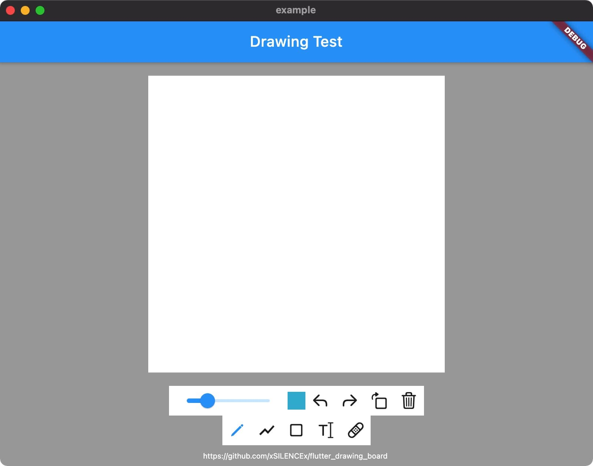
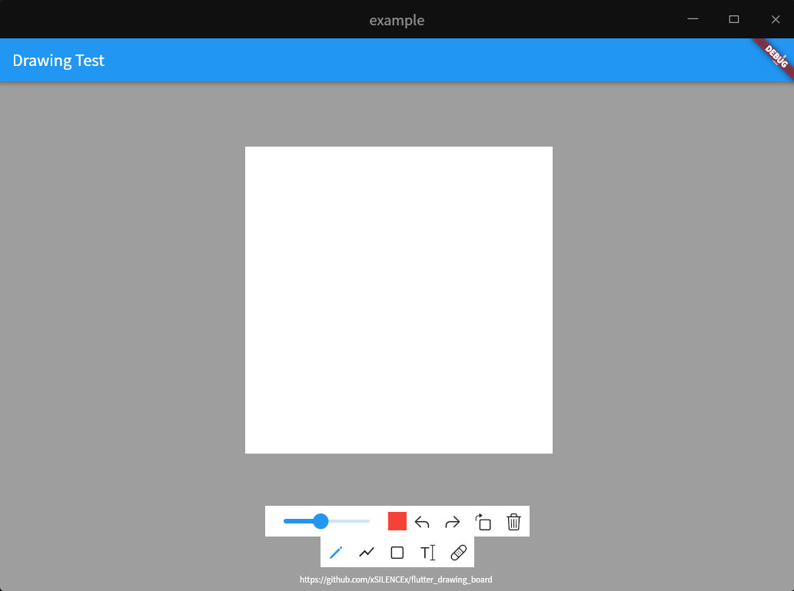

# flutter_drawing_board

A Flutter package of drawing board.


非空安全请使用git依赖 `non-nullsafety` 分支
```dart
flutter_drawing_board:
    git:
      url: https://github.com/xSILENCEx/flutter_drawing_board.git
      ref: non-nullsafety
```
使用方法
```dart
//simple example

import 'package:flutter_drawing_board/flutter_drawing_board.dart';

DrawingBoard(
  background: Container(width: 400, height: 400, color: Colors.white),
  showDefaultActions: true,
  showDefaultTools: true,
),
```

```dart
//获取画板数据

import 'package:flutter_drawing_board/flutter_drawing_board.dart';

final DrawingController _drawingController = DrawingController();

DrawingBoard(
  controller: _drawingController,
  background: Container(width: 400, height: 400, color: Colors.white),
  showDefaultActions: true,
  showDefaultTools: true,
),

Future<void> _getImageData() async {
  print((await _drawingController.getImageData()).buffer.asInt8List());
}
```

## 效果预览

预览网址:[https://painter.liugl.cn](https://painter.liugl.cn)

### Phone


### Web


### Windows


### macOS


### Linux

